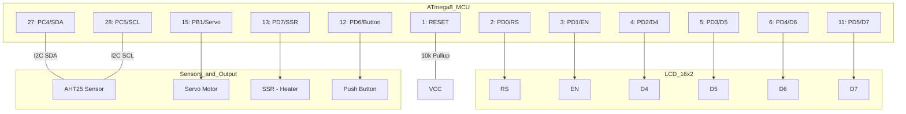

# AVR Hatchery System (孵卵器制御システム)

ATmega8 マイコンを使用した、高精度な温度管理と自動転卵機能を備えた孵卵器制御システムです。

## 主な機能

- **高精度温度制御**: PIDアルゴリズムによるSSR（ソリッド・ステート・リレー）駆動。タイム・プロポーショナル制御（周期1秒）により、交流ヒーターを滑らかに制御します。
- **自動・手動転卵**: 2時間おきの自動転卵機能を搭載。振り子式機構に対応し、ボタン操作による即時反転も可能です。
- **リアルタイム・モニタリング**: LCD（16x2）に温度、湿度、ヒーター出力、次回の転卵までの残り時間を表示します。
- **安全機能**: AHT25センサーの異常を検知した際、ヒーターを強制停止する保護機能を備えています。

## 回路接続図 (Mermaid)



## ハードウェア構成 (ATmega8)


| ピン | 接続先 | 用途 |
| :--- | :--- | :--- |
| **PC4** | AHT25 SDA | 温湿度センサー データ (要4.7kΩプルアップ) |
| **PC5** | AHT25 SCL | 温湿度センサー クロック (要4.7kΩプルアップ) |
| **PB1** | Servo (PWM) | 転卵用サーボモーター信号 (OC1A) |
| **PD0** | LCD RS | 液晶制御信号 |
| **PD1** | LCD EN | 液晶制御信号 |
| **PD2-PD5** | LCD D4-D7 | 液晶データバス (4bitモード) |
| **PD6** | Button | 手動転卵ボタン (押下時にGND) |
| **PD7** | SSR | ヒーター制御用SSR信号 |

## ソフトウェア構成

- `main.c`: PID演算、メインステートマシン、表示ロジック
- `aht25.c / .h`: AHT25専用ドライバ（粘り強いリトライとCRC8検証機能付き）
- `i2c.c / .h`: ハードウェアTWIを使用したI2C通信（タイムアウト処理付き）
- `lcd.c / .h`: HD44780互換LCDドライバ（4bitモード）
- `servo.c / .h`: Timer1を使用した高精度PWMサーボ制御

## 動作仕様

### 表示内容
- **1行目**: `[現在温度]C H:[出力%]`
  - 例: `37.5C H: 45%`
- **2行目**: `[湿度]% Next:[転卵まで分]m`
  - 例: `55% Next:119m`

### 転卵ロジック
- 角度 `0度` と `60度` を2時間ごとに交互に切り替えます。
- PD6のボタンを押すと、タイマーをリセットして即座に反転します。

### 温度制御 (PID)
- 目標温度: `37.5℃`
- ヒーターの熱慣性に対応するため、1秒間のうちの通電時間を0.01秒刻みで調整します。

## ビルドと書き込み

### コンパイル
```bash
make clean all
```

### 書き込み (AVRISP使用時)
```bash
make flash
```

## 注意事項
- 実際の孵化に使用する前に、PIDパラメータ（`KP`, `KI`, `KD`）が使用するヒーターや容器の断熱性能に適しているか、十分な試運転を行ってください。
- SSRは必ずゼロクロス対応のものを使用し、交流電源の扱いに注意してください。
